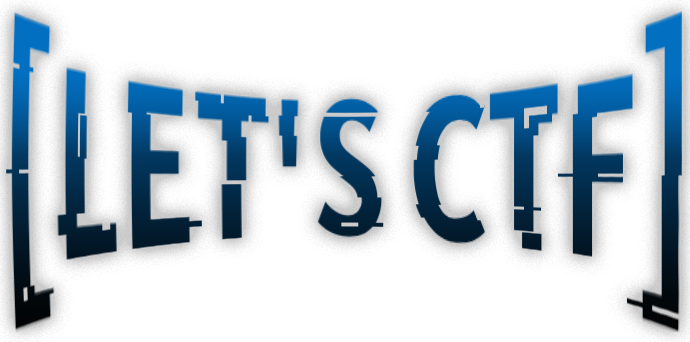
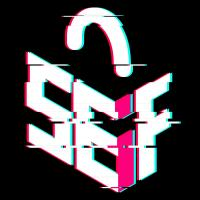

CTF SEIF - 16/02/2024

- [Introduction](#introduction)
- [Challenges](#challenges)
- [Statistics](#statistics)
  - [Progress](#progress)
  - [Awards](#awards)
  - [Solves](#solves)
- [Participants](#participants)
- [Scoreboard](#scoreboard)

URL: https://game.letsctf.com

# Introduction

Estás en LETSCTF!,

La plataforma de retos en la que podrás demostrar tu conocimiento y destreza ante diferentes desafíos de seguridad. Aquí encontrarás retos de dificultad variable y de muy diversas temáticas:

- Criptografía y Esteganografía
- Forense
- OSINT
- Reversing
- ETC

No importa tu nivel de conocimientos, siempre habrá una prueba para ti y podrás aprender mucho mientras juegas.

La plataforma ha sido desarrollada para apoyar a la generación de comunidades de estudiantes que, como nosotros, podáis estar interesados en la ciberseguridad pero no sepáis ni como ni por donde empezar.

La forma de participar es muy sencilla, tan solo debes registrarte en este portal y comenzar a jugar. Los tres participantes con mayor puntuación al finalizar el curso serán convocados a una entrega de premios donde recibirán un obsequio. Las pruebas permanecerán abiertas a lo largo del verano. Cada 1 de septiembre se añadirán nuevas pruebas y se reiniciará el contador de puntuación.

Para poder participar en alguno de los retos aquí planteados, debes registrarte en la plataforma y aceptar las siguientes normas:

- Cada desafío tendrá una puntuación. Deberás ir acumulando puntos para posicionarte en el ranking
- Si has consumido todos los intentos para resolver un reto tienes la posibilidad de seguir intentándolo, pero sin recibir ningún punto
- No están permitidos los ataques de Denegación de Servicio.
- No están permitidos los escaneos automatizados contra la plataforma
- No están permitidos ataques destructivos (no se podrá modificar ningún desafío ya que se perjudicaría el juego de otros jugadores)
- Es preciso mantener el objetivo en los puntos que están indicados para ello
- Si aun así encuentras una vulnerabilidad en nuestra infraestructura o algún atajo para resolver un desafío con mayor facilidad; os rogamos que nos informéis. De esta forma obtendréis un mayor reconocimiento y puntos de bonificación
- Las reglas pueden ser cambiadas por los organizadores en el transcurso del desafío
- En algunas ocasiones, y en función del número de jugadores y el tiempo utilizado para resolver un desafío, se podrá proporcionar alguna pista adicional
- Los jugadores que no acepten estas reglas podrán ser penalizados o, según el caso, expulsados de forma permanente de la plataforma

# Challenges

[1-cripto](1-crypto/)
[2-stego](2-stego/)
[3-misc](3-misc/)
[4-reversing](4-reversing/)
[5-forensics](5-forensics/)
[6-web](6-web/)
[7-osint](7-osint/)

# Statistics

## Progress

## Awards

- Hint #4: Hint for Jugando a los detectives (-2)
- Hint #5: Hint for Jugando a los detectives (-2)
- Hint #37: Hint for Las galletas de la abuelita (-5)
- Hint #38: Hint for Las galletas de la abuelita (-5)
- Hint #39: Hint for Sqlazo (-5)
- Hint #42: Hint for Super secure login (-5)
- Hint #43: Hint for Super secure login (-5)

## Solves

| Challenge                   | Category  | Value | Time                       |
| --------------------------- | --------- | ----- | -------------------------- |
| Las galletas de la abuelita | Web       | 20    | February 19th, 12:35:27 AM |
| Super secure login          | Web       | 20    | February 19th, 12:21:44 AM |
| Jugando a los detectives    | OSINT     | 10    | February 19th, 12:15:57 AM |
| Un presidente muy EXIFgente | Forensics | 20    | February 18th, 11:54:41 PM |
| Mucho texto                 | Forensics | 20    | February 18th, 11:50:46 PM |
| Sqlazo                      | Web       | 20    | February 16th, 3:59:08 PM  |
| clicker bypass              | Reversing | 20    | February 16th, 3:45:38 PM  |
| My brain is not braining    | Misc      | 20    | February 16th, 3:11:32 PM  |
| Gameboy                     | Stego     | 40    | February 16th, 3:08:35 PM  |
| Puzzle                      | Crypto    | 20    | February 16th, 2:10:58 PM  |
| Síguenos\_                  | Misc      | 10    | February 16th, 1:57:34 PM  |
| Sanity Check                | Misc      | 10    | February 16th, 1:45:23 PM  |

# Participants

| User           | Website                                     | Affiliation            | Country        |
| -------------- | ------------------------------------------- | ---------------------- | -------------- |
| Taleli         |                                             |                        |                |
| Overdjosed     |                                             |                        | American Samoa |
| salgac         |                                             |                        | San Marino     |
| Julls          |                                             |                        |                |
| Yisus Christ   |                                             |                        |                |
| Re1vaj         |                                             |                        |                |
| Sansus         |                                             | La Horda               | Antarctica     |
| Sergio Larriba |                                             |                        |                |
| borisu         |                                             |                        |                |
| Andres         |                                             |                        | Eritrea        |
| Luis N         |                                             |                        | Antarctica     |
| Asriel         | https://www.youtube.com/watch?v=dQw4w9WgXcQ | República de SEIFistán | Nauru          |
| retubo         |                                             |                        |                |
| JaviMario      |                                             |                        |                |
| Chema          |                                             |                        |                |
| zalinio        |                                             |                        |                |
| rodrigo        |                                             |                        |                |

# Scoreboard

| Place | User           | Score |
| ----- | -------------- | ----- |
| 1     | JaviMario      | 250   |
| 2     | salgac         | 210   |
| 3     | Yisus Christ   | 201   |
| 4     | retubo         | 200   |
| 5     | Sansus         | 175   |
| 6     | Re1vaj         | 155   |
| 7     | Taleli         | 150   |
| 8     | borisu         | 145   |
| 9     | Sergio Larriba | 145   |
| 10    | Andres         | 130   |
| 11    | Overdjosed     | 125   |
| 12    | Julls          | 118   |
| 13    | Luis N         | 110   |
| 14    | Asriel         | 50    |
| 15    | rodrigo        | 10    |
| 16    | zalinio        | 10    |
